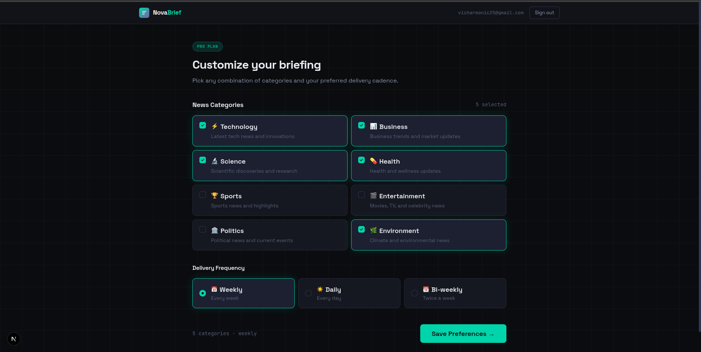

# NovaBrief — AI-Curated Newsletter SaaS

<div align="center">
  <br />
  
  <br />
  <div>
    
    
    
    
    
    
    
  </div>
  <h3 align="center">Personalized AI Newsletter SaaS — Next.js 15, Supabase, Gemini, Stripe & Inngest</h3>
</div>

---

## Table of Contents

1. [Overview](#overview)
2. [Tech Stack](#tech-stack)
3. [Architecture](#architecture)
4. [Features](#features)
5. [Quick Start](#quick-start)
6. [Service Configuration](#service-configuration)
7. [Database Setup](#database-setup)
8. [Running Locally](#running-locally)
9. [PWA](#pwa)
10. [Deployment](#deployment)
11. [Known Constraints](#known-constraints)

---

## Overview

NovaBrief is a production-ready newsletter SaaS where users select news categories, set a delivery frequency, and receive AI-generated briefings on schedule. The pipeline runs as a durable background workflow — articles are fetched from NewsAPI, summarized by Gemini 2.5 Flash, converted to HTML, and delivered via EmailJS.

Paid plans (monthly/yearly) are gated behind Stripe subscriptions. Free plan users get 4 categories and weekly delivery.

---

## Tech Stack

| Layer            | Technology                               |
| ---------------- | ---------------------------------------- |
| Framework        | Next.js 15 (App Router, Turbopack)       |
| Auth + DB        | Supabase (Postgres + Row Level Security) |
| AI Summarization | Google Gemini 2.5 Flash                  |
| Background Jobs  | Inngest (durable step functions)         |
| News Source      | NewsAPI                                  |
| Email Delivery   | EmailJS Node SDK                         |
| Payments         | Stripe (subscriptions + webhooks)        |
| Styling          | Tailwind CSS v4 + CSS custom properties  |
| Language         | TypeScript                               |
| PWA              | Web App Manifest + Service Worker        |

---

## Architecture

```
User action (save preferences)
  → POST /api/user-preferences
  → inngest.send("newsletter.schedule", { userId, email, categories, frequency })
  → Inngest Dev Server / Cloud receives event
  → Executes newsletter/scheduled function:
      step 1: check-user-status    (Supabase admin client)
      step 2: fetch-news           (NewsAPI)
      step 3: summarize-news       (Gemini 2.5 Flash)
      step 4: send-email           (EmailJS Node SDK)
      step 5: schedule-next        (inngest.send with ts offset)
```

Each step is independently retried on failure. State is checkpointed between steps — if step 3 fails, Inngest retries from step 3, not from the beginning.

**Key architectural decision — admin Supabase client for background jobs:**
Inngest functions run outside the Next.js request lifecycle. `cookies()` from `next/headers` is unavailable, so a separate `createAdminClient()` using `SUPABASE_SERVICE_ROLE_KEY` is used for all database access inside Inngest functions and the Stripe webhook handler.

---

## Features

- **Category selection** — 8 categories (Technology, Business, Science, Health, Sports, Entertainment, Politics, Environment). Free plan: first 4 only.
- **Delivery frequency** — Daily, weekly, bi-weekly. Free plan: weekly only.
- **AI-generated summaries** — Gemini 2.5 Flash produces structured, email-friendly newsletter content from raw article data.
- **Durable scheduling** — Inngest handles retries, step checkpointing, and future scheduling via `ts` offset on events.
- **Stripe billing** — Monthly ($9.99) and yearly ($99.99) plans. Webhook-driven subscription status synced to Supabase.
- **Free plan** — No card required. Immediately usable after signup, gated by `user_preferences` row existence.
- **PWA** — Installable on desktop and mobile, offline-capable static assets, `standalone` display mode.

---

## Quick Start

### Prerequisites

- Node.js v18+
- pnpm (or npm — scripts work with both)
- Supabase project
- Google AI Studio account (Gemini API key — free tier available)
- NewsAPI account (free tier: 1000 req/day, **localhost only** — see [Known Constraints](#known-constraints))
- EmailJS account
- Stripe account
- Inngest account (for production; dev server is zero-config locally)

### Clone and install

```bash
git clone https://github.com/yourusername/novabrief.git
cd novabrief
pnpm install
```

### Environment variables

Copy the example and fill in your keys:

```bash
cp env.example .env.local
```

Full `.env.local` reference:

```env
# ─── Google Gemini ────────────────────────────────────────────────────────────
GEMINI_API_KEY=your_gemini_api_key_here
# Get it free at: https://aistudio.google.com/apikey

# ─── News API ─────────────────────────────────────────────────────────────────
NEWS_API_KEY=your_news_api_key_here
# Register at: https://newsapi.org/register
# Free tier: 1000 req/day, localhost only (server-side requests blocked in production)
# Use NEXT_PUBLIC_NEWS_API_KEY if you hit undefined issues in dev (see Known Constraints)

# ─── EmailJS ──────────────────────────────────────────────────────────────────
EMAILJS_SERVICE_ID=service_xxxxxxx
EMAILJS_TEMPLATE_ID=template_xxxxxxx
EMAILJS_PUBLIC_KEY=your_emailjs_public_key
EMAILJS_PRIVATE_KEY=your_emailjs_private_key
# Dashboard: https://dashboard.emailjs.com
# Critical: Enable "Allow ServerSide (Node.js) requests" under Account → Security
# Template "To Email" field must be {{to_email}} (not {{email}})

# ─── Inngest ──────────────────────────────────────────────────────────────────
INNGEST_SIGNING_KEY=signkey-prod-xxxxxxxxxxxxxxxxxxxxxxxxxxxxxxxx
INNGEST_EVENT_KEY=evt-xxxxxxxxxxxxxxxxxxxxxxxxxxxxxxxx
# Production keys: https://app.inngest.com/env/production/manage/signing-key
# Leave INNGEST_SIGNING_KEY commented out during local dev (dev server doesn't need it)

# ─── Supabase ─────────────────────────────────────────────────────────────────
NEXT_PUBLIC_SUPABASE_URL=https://yourproject.supabase.co
NEXT_PUBLIC_SUPABASE_ANON_KEY=eyJhbGci...
SUPABASE_SERVICE_ROLE_KEY=eyJhbGci...
# Service role key: Supabase dashboard → Project Settings → API → service_role
# Required for Inngest functions and Stripe webhook (no cookie context available)

# ─── Stripe ───────────────────────────────────────────────────────────────────
STRIPE_SECRET_KEY=sk_texxxxxxxxxxxxxxxxxxxxxxxxxxx
NEXT_PUBLIC_STRIPE_PUBLISHABLE_KEY=pk_test_xxxxxxxxxxxxxxxxxxxxxxxx
STRIPE_WEBHOOK_SECRET=whsec_xxxxxxxxxxxxxxxxxxxxxxxx
STRIPE_MONTHLY_PRICE_ID=price_xxxxxxxxxxxxxxxxxxxxxxxx
STRIPE_YEARLY_PRICE_ID=price_xxxxxxxxxxxxxxxxxxxxxxxx
# Webhook secret is generated by stripe listen (local) or Stripe dashboard (production)

# ─── App ──────────────────────────────────────────────────────────────────────
NEXT_PUBLIC_APP_URL=http://localhost:3000
# Set to your production domain on Vercel: https://yourdomain.com
```

---

## Service Configuration

### Supabase

See [Database Setup](#database-setup) for the full SQL. Two tables required: `user_preferences` and `subscriptions`.

The `subscriptions` table uses a service role policy — Stripe webhooks write to it via `createAdminClient()`, bypassing RLS.

### Gemini

Free tier at [aistudio.google.com](https://aistudio.google.com/apikey). The function uses `gemini-2.5-flash` — fast, cost-effective, and handles the summarization prompt well. No SDK quirks; uses `@google/generative-ai`.

### NewsAPI

Free tier is restricted to **localhost** for server-side requests in production environments. For a production deploy you need a paid NewsAPI plan, or swap to an alternative:

- [GNews](https://gnews.io) — generous free tier
- [TheNewsAPI](https://www.thenewsapi.com) — free tier available
- [Currents API](https://currentsapi.services)

### EmailJS

Three steps to get working correctly:

1. **Enable server-side requests**: Dashboard → Account → Security → toggle on "Allow ServerSide (Node.js) requests"
2. **Template variables**: Your template's "To Email" field must be `{{to_email}}`, not `{{email}}`. The code sends `to_email` in `templateParams`.
3. **Private key**: Required for Node.js usage. Pass both `publicKey` and `privateKey` to `emailjs.send()`.

Free plan: 200 emails/month.

### Inngest

**Local development** — the Inngest Dev Server handles everything. No account or keys needed:

```bash
pnpm dlx inngest-cli dev -u http://localhost:3000/api/inngest
```

Open `http://localhost:8288` to inspect runs, replay events, and debug step output.

**Critical local dev note**: Comment out `INNGEST_SIGNING_KEY` in `.env.local` during development. A production signing key causes signature validation failures against the local dev server.

**Production**: Add both `INNGEST_SIGNING_KEY` and `INNGEST_EVENT_KEY` to your Vercel env vars, then sync your app in the Inngest Cloud dashboard: Apps → Add App → `https://yourdomain.com/api/inngest`.

### Stripe

Local webhook forwarding:

```bash
stripe listen --forward-to localhost:3000/api/webhooks
```

This outputs a webhook signing secret — use that as `STRIPE_WEBHOOK_SECRET` in `.env.local`. The secret from `stripe listen` is different from the one in the Stripe dashboard.

Make sure your `checkout.session.create` call passes `metadata: { userId }` — the webhook uses this to associate the subscription with a Supabase user. This is already handled in `app/api/checkout/route.ts`.

---

## Database Setup

Run these in the Supabase SQL editor (Dashboard → SQL Editor → New Query):

```sql
-- ─── User Preferences ────────────────────────────────────────────────────────
CREATE TABLE IF NOT EXISTS public.user_preferences (
  id          bigint GENERATED BY DEFAULT AS IDENTITY PRIMARY KEY,
  created_at  timestamptz NOT NULL DEFAULT now(),
  updated_at  timestamptz NOT NULL DEFAULT now(),
  user_id     text NOT NULL UNIQUE,
  email       text NOT NULL,
  categories  text[] NOT NULL DEFAULT '{}',
  frequency   text NOT NULL DEFAULT 'weekly',
  is_active   boolean NOT NULL DEFAULT true
);

ALTER TABLE public.user_preferences ENABLE ROW LEVEL SECURITY;

CREATE POLICY "Users can view their own preferences"
  ON public.user_preferences FOR SELECT
  USING (user_id = auth.uid()::text);

CREATE POLICY "Users can insert their own preferences"
  ON public.user_preferences FOR INSERT
  WITH CHECK (user_id = auth.uid()::text);

CREATE POLICY "Users can update their own preferences"
  ON public.user_preferences FOR UPDATE
  USING (user_id = auth.uid()::text)
  WITH CHECK (user_id = auth.uid()::text);

CREATE POLICY "Users can delete their own preferences"
  ON public.user_preferences FOR DELETE
  USING (user_id = auth.uid()::text);

CREATE INDEX IF NOT EXISTS idx_user_preferences_user_id ON public.user_preferences(user_id);
CREATE INDEX IF NOT EXISTS idx_user_preferences_is_active ON public.user_preferences(is_active);

CREATE OR REPLACE FUNCTION public.set_updated_at()
RETURNS trigger AS $$
BEGIN
  NEW.updated_at = now();
  RETURN NEW;
END;
$$ LANGUAGE plpgsql;

DROP TRIGGER IF EXISTS trg_user_preferences_updated_at ON public.user_preferences;
CREATE TRIGGER trg_user_preferences_updated_at
BEFORE UPDATE ON public.user_preferences
FOR EACH ROW EXECUTE FUNCTION public.set_updated_at();
```

```sql
-- ─── Subscriptions ───────────────────────────────────────────────────────────
CREATE TABLE public.subscriptions (
  id                      uuid PRIMARY KEY DEFAULT gen_random_uuid(),
  user_id                 uuid NOT NULL REFERENCES auth.users(id) ON DELETE CASCADE,
  status                  text NOT NULL DEFAULT 'inactive',
  stripe_customer_id      text,
  stripe_subscription_id  text,
  stripe_price_id         text,
  current_period_start    timestamptz,
  current_period_end      timestamptz,
  cancel_at_period_end    boolean DEFAULT false,
  created_at              timestamptz DEFAULT now(),
  updated_at              timestamptz DEFAULT now()
);

CREATE INDEX ON public.subscriptions(user_id);
ALTER TABLE public.subscriptions ADD CONSTRAINT subscriptions_user_id_unique UNIQUE (user_id);
ALTER TABLE public.subscriptions ENABLE ROW LEVEL SECURITY;

CREATE POLICY "Users can view own subscription"
  ON public.subscriptions FOR SELECT
  USING (auth.uid() = user_id);

-- Service role bypasses RLS — required for Stripe webhook writes
CREATE POLICY "Service role full access"
  ON public.subscriptions
  USING (true)
  WITH CHECK (true);
```

---

## Running Locally

Three terminals:

```bash
# Terminal 1 — Next.js (Turbopack)
pnpm dev

# Terminal 2 — Inngest Dev Server
pnpm dlx inngest-cli dev -u http://localhost:3000/api/inngest

# Terminal 3 — Stripe webhook forwarding
stripe listen --forward-to localhost:3000/api/webhooks
```

Or use the combined script (runs Next.js + Inngest together; start Stripe separately):

```bash
pnpm dev:all
```

**Verify everything is wired up:**

```bash
# Should return Inngest introspection JSON, not a redirect
curl http://localhost:3000/api/inngest
```

If you get redirected to `/signin`, check `lib/supabase/middleware.ts` — `/api/inngest` must be whitelisted in the auth guard.

Open `http://localhost:8288` → Apps tab → your app should show as synced with `newsletter/scheduled` listed under Functions. If it shows "Not Synced", the dev server can't reach your app — try `127.0.0.1` instead of `localhost` in the `-u` flag.

---

## PWA

NovaBrief ships as a PWA-conformant app:

- **`/public/manifest.json`** — web app manifest with icons, theme color, display mode
- **`/public/sw.js`** — service worker with network-first navigation, cache-first static assets
- **`app/layout.tsx`** — registers the SW on load, includes all required meta tags

**You need to generate actual PNG icons** from your logo before deploying. The `public/icons/` directory is a placeholder. Use one of:

```bash
# Option A — sharp (Node.js)
pnpm add -D sharp
node -e "
const sharp = require('sharp');
const sizes = [72, 96, 128, 144, 152, 192, 384, 512];
sizes.forEach(s => sharp('public/novabrief2.png').resize(s,s).toFile(\`public/icons/icon-\${s}x\${s}.png\`));
"

# Option B — online
# https://www.pwabuilder.com/imageGenerator — upload your logo, download the zip
```

The service worker intentionally uses **network-first for navigation** (HTML pages) to ensure auth state is never stale. Static assets (`_next/static/`, fonts, images) use cache-first.

---

## SEO

The following are already implemented in `app/layout.tsx`:

- `<title>` with template (`%s | NovaBrief`) for per-page titles
- `description`, `keywords`, `authors`
- OpenGraph tags (title, description, image, type, locale)
- Twitter Card (`summary_large_image`)
- `robots` (index + follow)
- `metadataBase` — set `NEXT_PUBLIC_APP_URL` to your production domain

**What you should add per-page:**

For pages that warrant unique SEO (subscribe, signin), export a `metadata` object:

```typescript
// app/subscribe/page.tsx
export const metadata = {
  title: "Choose Your Plan",
  description:
    "Start free or unlock the full NovaBrief experience. AI-powered newsletters on your schedule.",
};
```

**Structured data** (optional but worthwhile for a SaaS):

Add a `SoftwareApplication` JSON-LD block to `layout.tsx`:

```typescript
<script
  type="application/ld+json"
  dangerouslySetInnerHTML={{
    __html: JSON.stringify({
      "@context": "https://schema.org",
      "@type": "SoftwareApplication",
      name: "NovaBrief",
      applicationCategory: "NewsApplication",
      offers: { "@type": "Offer", price: "0", priceCurrency: "USD" },
      description: "AI-curated personalized news briefings delivered on your schedule.",
    }),
  }}
/>
```

---

## Deployment

### Vercel

```bash
# Push to GitHub, then connect repo in Vercel dashboard
# Or deploy directly:
vercel --prod
```

**Environment variables to set in Vercel dashboard** (Settings → Environment Variables):

```
GEMINI_API_KEY
NEWS_API_KEY
EMAILJS_SERVICE_ID
EMAILJS_TEMPLATE_ID
EMAILJS_PUBLIC_KEY
EMAILJS_PRIVATE_KEY
INNGEST_SIGNING_KEY          ← uncomment/enable for production
INNGEST_EVENT_KEY            ← required for production (inngest.send() auth)
NEXT_PUBLIC_SUPABASE_URL
NEXT_PUBLIC_SUPABASE_ANON_KEY
SUPABASE_SERVICE_ROLE_KEY
STRIPE_SECRET_KEY
NEXT_PUBLIC_STRIPE_PUBLISHABLE_KEY
STRIPE_WEBHOOK_SECRET        ← use the one from Stripe dashboard (not stripe listen)
STRIPE_MONTHLY_PRICE_ID
STRIPE_YEARLY_PRICE_ID
NEXT_PUBLIC_APP_URL          ← your production domain, e.g. https://novabrief.vercel.app
```

**Post-deploy checklist:**

1. Sync app with Inngest Cloud: [app.inngest.com](https://app.inngest.com) → Apps → Add App → `https://yourdomain.com/api/inngest`
2. Add production webhook in Stripe dashboard: `https://yourdomain.com/api/webhooks` listening for `checkout.session.completed`, `customer.subscription.updated`, `customer.subscription.deleted`
3. Update Supabase Auth → URL Configuration → Site URL and Redirect URLs to your production domain
4. Swap NewsAPI for a paid plan or alternative (free tier blocks server-side production requests)

---

## Known Constraints

| Constraint            | Detail                                                                                                                                                                                                                                               |
| --------------------- | ---------------------------------------------------------------------------------------------------------------------------------------------------------------------------------------------------------------------------------------------------- |
| NewsAPI free tier     | Blocks server-side requests in production environments. Works fine on localhost. Upgrade to a paid plan or swap to GNews/TheNewsAPI for production.                                                                                                  |
| EmailJS free tier     | 200 emails/month. Sufficient for testing; plan accordingly for production volume.                                                                                                                                                                    |
| Inngest local         | `INNGEST_SIGNING_KEY` must be absent or commented out during local dev. The dev server doesn't validate signatures.                                                                                                                                  |
| `createAdminClient()` | Any code that runs outside a Next.js request context (Inngest functions, Stripe webhook) must use `lib/supabase/admin.ts`, not `lib/supabase/server.ts`. The server client uses `cookies()` from `next/headers` which throws outside a live request. |
| `daily` scheduling    | Currently schedules next run 24h out. During testing you may want to temporarily lower this in `inngest/functions/scheduled-newsletter.ts`.                                                                                                          |

---

## License

MIT
